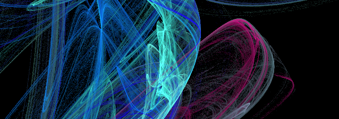

[^3]
> A light discord bot, based of jester's pom with: youtube audio playback, persistent dice rolls, rock-paper-scissors, coinflips and meatballs!

### get started
To get started, get NodeJs v20[^1], create a discord bot at https://discord.com/developers/applications, rename and provide the values inside config.json[^2].  
Now run ``npm install`` to install any needed packages and then ``node .`` to start cato!  

To add the bot to your server, create an invite at https://discord.com/developers/applications/your-app-id/oauth2 and give it these permissions: ``permissions=1261440091730084003``, ``scope=applications.commands+bot``.

### docker
A dockerfile is also provided in oci_image/ , to build and run the image simply run:

``docker build --progress=plain -t cato:latest -f oci_image/Dockerfile .``

and 

``docker run -d -e BOT_TOKEN='YOUR-BOT-TOKEN' -e BOT_ID='YOUR-BOT-CLIENT-ID' cato:latest``.

A docker compose file is also provided in oci_image/ , where you again have to fill in the variables with your token and client id. (You will need to first build the image tho)

### Sidenotes
To be able to speak in voice channels, discord bots apparently need UDP ingress ports 2^15 -> 2^16-1 open.

[^1]: Needed for json asserts to our config file.
[^2]: Actually needed are only the token and the client id
[^3]: A very nice flame fractal!